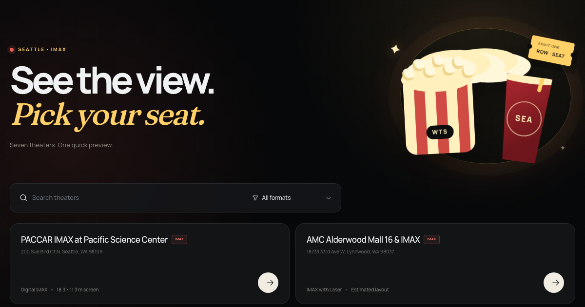

# Where to Sit

A mobile-friendly Seattle IMAX seat-view simulator. Choose a theater, try a
seat, and preview how the screen may feel before buying a ticket.

[Try the live experience](https://www.leozhao.me/projects/where-to-sit/) ·
[Open the PACCAR simulator](https://www.leozhao.me/projects/where-to-sit/cinema/paccar-imax/)



## What it does

- Finds the nearest listed theater when location permission is granted.
- Compares seven Seattle Metro IMAX venues.
- Lets you select an illustrative seat in an interactive 3D auditorium.
- Changes the camera perspective for every selected position.
- Includes a mobile layout, keyboard controls, reduced-motion support, and a
  non-WebGL fallback.

## Seattle data boundary

- The selector contains seven active Seattle Metro IMAX candidates.
- PACCAR uses its officially published 60 ft × 37 ft screen measurements.
- No reusable fixed seating plan is available for these venues, so every displayed seat grid is labeled `Estimated seat layout`.
- Room depth, row spacing, elevation, seat positions, screen distance and viewing angles are illustrative geometric estimates.
- No ticketing seat map, live availability, prices or showtimes are scraped or displayed.

See [the Seattle simulability research](./docs/SEATTLE_IMAX_SIMULABILITY.md) for the evidence needed to upgrade an auditorium from estimated to verified geometry.

## Run locally

Requires Node.js 22 or newer.

```bash
npm install
npm run dev
```

Open `http://localhost:3000`.

For the production export:

```bash
npm run validate
npm start -- --listen 4173
```

To export for the live subdirectory:

```bash
NEXT_PUBLIC_BASE_PATH=/projects/where-to-sit \
NEXT_PUBLIC_SITE_URL=https://www.leozhao.me/projects/where-to-sit/ \
npm run build
```

## Stack

Next.js, TypeScript, React Three Fiber, Three.js, and static JSON data. The app
exports as static files and does not require an account, database, analytics,
or location storage.

## Legal

Required third-party license notices are retained in
[`THIRD_PARTY_LICENSES/`](./THIRD_PARTY_LICENSES/). External cinema inventory,
captured seat layouts, trademarks, and movie media are not included. Seattle
venue facts come from the project's evidence audit, and the included test reel
uses original neutral artwork.

This project is independent and unofficial. It is not affiliated with IMAX Corporation or any listed theater operator.
